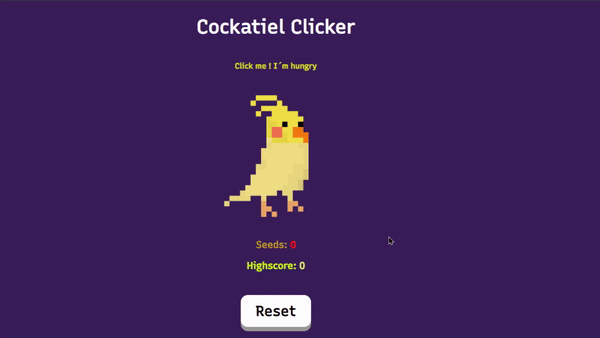

## 🦜 Cockatiel Clicker Game 🖱️

> Clicker game with HTML, CSS and JS.

### 📄 About 

A simple clicker game for learning.

### 🚀 Launch

Clone this repository in a directory and check it !

#### Demo

Try demo [here](https://replit.com/@le4nnt0nn/CockatielClickerGame).
 
### 🧪 Technologies

Used [HTML](https://www.w3schools.com/html/"), [CSS]("https://www.w3schools.com/css/") and [JavaScript]("https://www.w3schools.com/js/").

### 📋 Features

* Added **bonus**.
* Highscore.
* Reset button.
* Implemented sounds.

### 📷 Templates

***

    <h4>Action Overview</h4>
    

